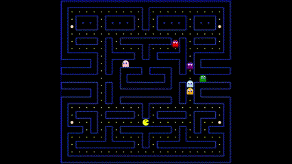

# Pac-Man

## Objective
Pac-Man is a classic arcade game where the player navigates Pac-Man through a maze, eating pellets and avoiding ghosts. This project is a web-based implementation of the game using JavaScript, HTML, and CSS.


## Tools
- **JavaScript**: For game logic and interactivity.
- **HTML**: For structuring the game interface.
- **CSS**: For styling the game.
- **Node.js**: 
  - Managing dependencies with `npm`.
  - Running a local development server using `http-server`.
  - Using GitHub Actions for Continuous Integration (CI) to deploy the application to GitHub Pages.

## Project Structure
   ```sql
Pac-Man/
├── .github/
│ └── workflows/
│ └── ci.yml
├── src/
│ ├── assets/
│ ├── classes/
│ │ ├── boundary.js
│ │ ├── ghost.js
│ │ └── powerPellet.js
│ ├── collisions/
│ │ └── collisions.js
│ ├── keyboard/
│ │ └── inputHandlers.js
│ ├── maze/
│ │ └── mapOrigin.js
│ ├── index.html
│ ├── index.js
│ └── styles.css
├── .gitignore
├── package.json
└── README.md
  ```
## Scripts
- `npm start`: Start the development server.
- `npm install`: Install dependencies.

## GitHub Pages
You can play the [game](https://gadiim.github.io/Pac-Man/)

## License
This project is licensed under the MIT [LICENSE](LICENSE).
